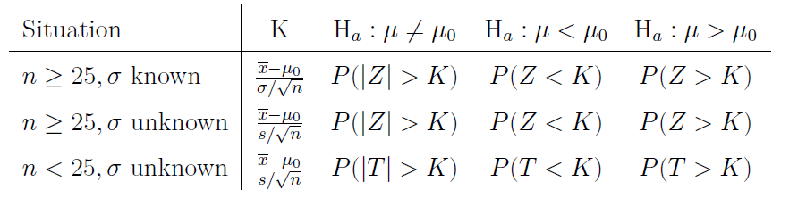

---

output: 
  xaringan::moon_reader:
    lib_dir: libs
    nature:
      highlightStyle: github
      highlightLines: true
      countIncrementalSlides: false

---

```{r setup, echo=FALSE, message=FALSE}
library(knitr)
library(tidyverse)
library(xtable)
library(MASS)
knitr::opts_chunk$set(echo=FALSE, message=FALSE, warning=FALSE, fig.height = 2)
theme_set(theme_bw(base_family = "serif"))
set.seed(305)
```
class: center, middle, inverse
layout: yes
name: inverse

## STAT 305: Chapter 6 - Part II
## Hypothesis Testing
### Amin Shirazi
.footnote[Course page: [ashirazist.github.io/stat305.github.io](https://ashirazist.github.io/stat305.github.io/)] 
---
class: center, middle, inverse
layout: yes
name: inverse

# Hypothesis Testing
## Deciding What's True (Even If We're Just Guessing)
---
class: center, middle, inverse
layout: yes
name: inverse

# Let's Play A Game
## A "Friendly" Introduction to Hypothesis Tests
---
layout:false
.left-column[
### My Game
### The Rules
]
.right-column[
## Let's Play A Game
The semester is getting a little intense! You are a livinLet's break the tension with a friendly game. 

Here are the rules:
- I have a new deck of cards. 52 Cards, 26 with Suits that are Red, 26 with Suits that are Black
- You draw a red-suited card, you give me a dollar
- You draw a black-suited card, I give you two dollars

**Quick Questions** 

What is the expected number of dollars you will win playing this game?

Would you play this game?
]
---
name: inverse
layout: true
class: center, middle, inverse
---
# Are We Forgetting Something?
---
layout:false
.left-column[
### My Game
### The Rules
### The Assumptions
]
.right-column[
### Be Careful About Your Assumptions

Pause for a minute and think about what you are assuming is true when you play this game. For instance,
- You assume I'm going to shuffle the cards fairly
- You assume there are 52 cards in the deck
- You assume the deck has 26 red-suited cards in it
- You assume the deck has **a** red-suited card in it

How can we make sure the assumptions are safe??
- Shuffling assumption: watch me shuffle, make sure I'm not doing magic tricks, etc 
- 52 Cards assumption: count the cards
- Red-suit assumption: Count the number of red cards

Whew! We can actually make sure all of our assumptions are good!
]
---
name: inverse
layout: true
class: center, middle, inverse
---
# One Problem
## I Refuse to Show You The Cards
---

## Do You Trust Me?
---
layout:false
.left-column[
### My Game
### The Rules
### The Assumptions
]
.right-column[
### Our Assumptions

I'm not going to show you all the cards. In other words, I refuse to show you the _population of possible outcomes_. This is justified: we are in a statistics course after all. 

So, let's start with our unverifiable assumption: Is it safe to assume that this is a fair game. Why would we make this assumption?

- You trust that I'm (basically) an honest person (*assumption of decency*)
- You trust that I'm getting paid enough that I wouldn't risk cheating students out of money (*assumption of practicality*)
- You saw the deck was new (*manufacturer trust assumption*)
- You want it to be an fair game because you would win lots of money if it was (*assumption in self-interest*)
]
---
layout:false
.left-column[
### My Game
### The Rules
### The Assumptions
]
.right-column[
### Our Assumptions

In statistical terminology, we wrap all these assumptions up into one assumption: our "**null hypothesis**" is that the game is not rigged - that the probability of you winning is 0.5

>**Null Hypothesis** </br>
>The assumptions we are operate under in normal circumstances (i.e., what we believe is true). We wrap these assumptions up into a statistical/mathematical statement, but we will accept them unless we have reason to doubt them. We use the notation $H_0$ to refer to the null hypothesis.

In this case, we could say that the probability of winning is $p$ and that would make our null hypothesis
$$H_0: p = 0.5$$

]
---
layout:false
.left-column[
### My Game
### The Rules
### The Assumptions
]
.right-column[
### Our Assumptions

Of course our assumptions could be wrong. We call the other assumptions our "alternative hypothesis":

>**Alternative Hypothesis** </br>
>The conditions that we do require proof to accept. We would have to change our beliefs based on evidence. We use the notation $H_A$ (or sometimes, $H_1$) to refer to the alternative hypothesis.

In this case, we could say that our alternative to believing the game is "fair" is to believe the game is not fair, or that the probability of winning is not $0.5$. We write:
$$H_A: p = 0.5$$

]
---
name: inverse
layout: true
class: center, middle, inverse
---
# A Compromise
## I Won't Show You All The Cards
## But I Will Let You Test The Game
---
layout:false
.left-column[
### My Game
### The Rules
### The Assumptions
### The Test
]
.right-column[
### Testing the Game

The test of whether or not the game is worth playing can be defined in term of whether or not our assumptions are true. In other words, we are going to test whether our null hypothesis is correct:

>**Hypothesis Tests** </br>
A **hypothesis test** is a way of checking if the outcomes of a random experiment are _statistically unusual_ based on our assumptions. If we see really unusual results, then we have **statistically significant** evidence that allows us to **reject our null hypothesis**. If our assumptions lead to results that are not unusual, then we **fail to reject our null hypothesis**.
]
---
layout:false
.left-column[
### My Game
### The Rules
### The Assumptions
### The Test
]
.right-column[
### Testing the Game

So how can we test the game? What if we tried a single round of the game? 
- What are the probabilities of the outcome of a single game? 
- If we draw a single card do we have enough evidence that the game is fair? 
- Do we have enough evidence that the game is rigged? 

Based on a single round of the game, both of the possibel outcomes are pretty normal - that's not good enough. 

If we draw a losing card, then we might be inclined to call the game unfair - even though a losing card is pretty common for a single round of the game

If we draw a winning card, then we might be inclined to call the game fair - even though a winning card may be common even when the game is not fair!

**We can make lots of mistakes!!**

]
---
layout:false
.left-column[
### My Game
### The Rules
### The Assumptions
### The Test
### The Errors
]
.right-column[
### The Mistakes We Might Make

We could of course be wrong: For instance, we could, just by random chance, see outcomes that are unusual for the assumptions we make and reject the assumptions even if (in reality they are true). This is called a "Type I Error"

>**Type I Error** </br>
>When the results of a hypothesis test lead us to reject the assumptions, while the assumptions are actually true, we have committed a Type I Error.
]
---
layout:false
.left-column[
### My Game
### The Rules
### The Assumptions
### The Test
### The Errors
]
.right-column[
### The Mistakes We Might Make

A common example of this is found in criminal court: 
- We assume that a individual accused of a crime is innocent (our assumption)
- After examinig the evidence, we conclude that it is there is no reasonable doubt the person is not innocent (in other words, we reject the assumption because it is very unlikely to be true based on our evidence).
- If the person truly is innocent, then we have committed a Type I error (rejecting assumptions that were true).

]
---
layout:false
.left-column[
### My Game
### The Rules
### The Assumptions
### The Test
### The Errors
]
.right-column[
### The Mistakes We Might Make

We could also make a different error: we could choose not to reject the assumptions when in reality the assumptions are wrong.

>**Type II Error** </br>
>When the results of a hypothesis test lead us to fail to reject the assumptions, while the assumptions are actually false, we have committed a Type II Error.
]
---
layout:false
.left-column[
### My Game
### The Rules
### The Assumptions
### The Test
### The Errors
]
.right-column[
### The Mistakes We Might Make

Again, if we consider the example of criminal court: 
- We assume that a individual accused of a crime is innocent (our assumption)
- After examinig the evidence, we conclude that it is there is **not** evidence beyond a reasonable doubt the person is not innocent (in other words, the evidence is not enough to reject our assumption because it is still reasonable to doubt the accused's guilt).
- If the person truly is not innocent, then we have committed a Type II error (failing to reject assumptions that were false).

In general, we want to make sure that a Type I error is unlikely. To take the example of court again,
- We commit a Type II error: a guilty person goes free
- We commit a Type I erro: an innocent person goes to jail; the guiilty person is still free

]
---
layout:false
.left-column[
### My Game
### The Rules
### The Assumptions
### The Test
### The Errors
]
.right-column[
### The Mistakes We Might Make

Let's go back to my game: We assume I am an honest person (i.e., we assume that the probability of winning a single game is $p = 0.5$)

**Type I Error: Rejecting True Assumptions**
- We gather evidence
- Looking at our evidence, we decide that the game was not fair even though it was.
- Fallout: you slander me, you disparge me, we have a fight, there is ill will in the class.

**Type II Error: Failing to Reject False Assumptions**
- We gather evidence
- Looking at our evidence, we decide that the game was fair even though it was not.
- Fallout: you play the game and lose some money.

Ideally, we won't make either error. However, we can only base our decision of our evidence we can gather - the truth is out of our grasp!

]
---
layout:false
.left-column[
### My Game
### The Rules
### The Assumptions
### The Test
### The Errors
### The Evidence
]
.right-column[
### Gathering Statistical Evidence

Okay, so we don't want to make either error - that means we need good evidence.

Like we talked about before, even if the game is fair one test round of the game would not be enough to make a good decision since drawing a red-suited card and drawing a black-suited card are both pretty normal for a single round of the game.

But what if we played the game 10 times in a row? After 10 rounds, do you think we would have enough evidence to make a decision about our assumption?
]
---
layout:false
.left-column[
### My Game
### The Rules
### The Assumptions
### The Test
### The Errors
### The Evidence
]
.right-column[

If we assume the null hypothesis, then we can make some assumptions about what results are likely and what results are unlikely. We describe the likelihood of the results that we actually get using a **p-value**

>**p-value** </br>
>After gathering evidence (aka, data) we can determine the probability that we would have gotten the evidence we did if our assumptions were true. That probabiliity is called the p-value. If the p-value is really, really small that means that the assumptions we started with are pretty unlikely and we reject our assumptions. If the p-values is not small, then the evidence collected (aka, the data) is pretty normal for our assumptions and we fail to reject our assumptions.
]
---
layout:false
.left-column[
### My Game
### The Rules
### The Assumptions
### The Test
### The Errors
### The Evidence
]
.right-column[

In other words, we collect evidence and determine a way to measure the whether or not our data was unusual *if our assumptions are true*. 

If we have a very, very low chance of 
- seeing both our results and 
- having true assumptions
then we reject the assumptions

Going along with the terminology we have introduced, if we have a small p-value the we reject our null hypothesis.

]
---
layout:false
.left-column[
### My Game
### The Rules
### The Assumptions
### The Test
### The Errors
### The Evidence
]
.right-column[
### Gathering Statistical Evidence

In this game, if we assume that the game is fair, we have

- two outcomes: success (winning) and failure (losing)
- a constant chance of a successful outcome ($p = 0.5$, assuming the game is fair)
- independent rounds of the game (assuming fair shuffle, which we can check)

In other words, if we test the game 10 times we can model the number of successful outcomes as binomial: For $X$ = the total number of wins,

$$
P(X = x) = \dfrac{10!}{x!}{(10-x)!} (0.5)^x (1 - 0.5)^{10 - x}
$$

This gives us a way of getting our p-value
]
---
name: inverse
layout: true
class: center, middle, inverse
---
# Let's Test the Game
---
layout:false
.left-column[
### My Game
### The Rules
### The Assumptions
### The Test
### The Errors
### The Evidence
### The Conclusion
]
.right-column[
### Gathering Statistical Evidence

We played the game. Let's figure out whether our results were unusual or not.

Again, we assume the game is fair and have decided that the number of times we win will follow a binomial distribution with probabiliity function
$$
P(X = x) = \dfrac{10!}{x!}{(10-x)!} (0.5)^x (1 - 0.5)^{10 - x}
$$

Now we need to make a conclusion: do we accept or reject our assumptions? What do we consider unusual? Is it fair to decide after we play?

]
---
layout:false
.left-column[
### My Game
### The Rules
### The Assumptions
### The Test
### The Errors
### The Evidence
### The Conclusion
]
.right-column[
### Summary

- Sometimes we can know if something is true or not by examining the truth directly, but not always
- When we can't examine the truth, we need to test what we believe to be true
- A statistical test is a tool for testing our assumptions about what we believe
  - We state our assumed belief (generally our current beliefs, or the ethical beliefs, or the beliefs we hope are true, ...)
  - We come up with a way of collecting data that could validate or invalidate our assumption
  - We measure how likely it was that we would have gathered the data we did if our assumptions were correct
  - We reject the assumptions if our data is very unlikely we are our current beliefs 

]
---
layout: true
class: center, middle, inverse

##Now let's make everything 
##a little more formal
---
layout: true
class: center, middle, inverse

#Section 6.3
#Hypothesis Testing
---
layout:false
.left-column[
###Hypothesis Testing
]
.right-column[

## Hypothesis testing

Last section illustrated how probability can enable confidence interval estimation. We can also use probability as a means to use data to quantitatively assess the plausibility of a trial value of a parameter.

**Statistical inference** is using data from the sample to draw conclusions about the population.

>1. **Interval estimation (confidence intervals):** <br>
<span style="color:red">Estimates</span> population parameters and specifying the degree of precision of the estimate. 


>2. **Hypothesis testing:** <br>
Testing the <span style="color:red">validity</span> of statements about the population that are formed in terms of parameters.

]
---
layout:false
.left-column[
###Hypothesis Testing
###Null
]
.right-column[
###Definition:<br>
Statistical **significance testing** is the use of data in the quantitative assessment of the plausibility of some trial value for a parameter (or function of one or more parameters).<br> 
Significance (or hypothesis) testing begins with the specification of a trial value (or **hypothesis**).

A **null hypothesis** is a statement of the form
$$\text{Parameter}=\#$$
or
$$\text{Function of parameters}=\#$$
for some $\#$ that forms the basis of investigation in a significance test. A null hypothesis is usually formed to embody a status quo/"pre-data" view of the parameter. It is denoted $\text{H}_0$.

]

---
layout:false
.left-column[
###Hypothesis Testing
###Null
###Alternative
]
.right-column[
###Definition:<br>
An **alternative hypothesis** is a statement that stands in opposition to the null hypothesis. It specifies what forms of departure from the null hypothesis are of concern. An alternative hypothesis is denoted as $\text{H}_a$. It is of the form 
$$\text{Parameter}\not=\# \quad$$ 
or 
$$\quad \text{Parameter}>\# \quad \text{ or } \quad \text{Parameter}<\# \quad$$

Examples (testing the true mean value):
\begin{eqnarray*}
\text{H}_0: \mu = \# & \text{H}_0: \mu = \# & \text{H}_0: \mu = \# \\
\text{H}_a: \mu \not= \# & \text{H}_a: \mu > \# & \text{H}_a: \mu < \#
\end{eqnarray*}
Often, the alternative hypothesis is based on an investigator's suspicions and/or hopes about th true state of affairs.

]
---
layout:false
.left-column[
###Hypothesis Testing
###Null
###Alternative
]
.right-column[
The **goal** is to use the data to debunk the null hypothesis in favor of the alternative.

1. Assume $\text{H}_0$.

2. Try to show that, under $\text{H}_0$, the data are preposterous.(using probability)

3. If the data are preposterous, reject $\text{H}_0$ and conclude $\text{H}_a$.

The outcomes of a hypothesis test consists of:


]
---
layout:false
.left-column[
###Hypothesis Testing
###Null
###Alternative
]
.right-column[
**Example:** [Fair coin]

Suppose we toss a coin $n=25$ times, and the results are denoted by $X_1,X_2,\dots,X_{25}$. We use $1$ to denote the result of a head and $0$ to denote the results of a tail. Then $X_1 \sim Binomial(1,\rho)$ where $\rho$ denotes the chance of getting heads, so $\text{E}(X_1) = \rho, \text{Var}(X_1) = \rho(1-\rho)$. Given  the result is you got all heads, do you think the coin is fair?
\begin{align}
\text{Null hypothesis}&:  H_0: \text{the coin is fair or } H_0: \rho= 0.5\\
\text{Alternative hypothesis} &: H_a: \rho \ne 0.5
\end{align}

If H_0 was correct, then $P(\text{results are all heads})= (1/2)^{25}< 0.000001$

>I don't think this coin is fair (reject H_0 in favor of H_a)

]
---
layout:false
.left-column[
###Hypothesis Testing
###Null
###Alternative
]
.right-column[
In the real life, we may have data from many different kinds of distributions! Thus we need a universal framework to deal with these kinds of problems.

We have $n= 25 \ge 25$ iid trials $\Rightarrow$ By CLT we know if $H_0: \rho = 0.5 (= \text{E}(X))$ then
$$\dfrac{\overline{X}- \rho}{\sqrt{\rho(1-\rho)/n}}\sim N(0,1) $$
We obsrved $\overline{X} = 1$, so 
$$\dfrac{\overline{X}- 0.5}{\sqrt{0.5(1-0.5)/25}}= \dfrac{1- 0.5}{\sqrt{0.5(1-0.5)/25}} = 5 $$
Then the probability of seeing as <span style="color: red"> *wierd or wierder* </span> data is 
\begin{align}
P(\text{Observing something wierd or wierder})& = \\  
P(Z\   \text{bigger than 5 or less than -5} )\\
< 0.000001 
\end{align}
]
---
layout:true
class: center, middle, inverse

#Significance Tests for a Mean $\mu$

---
layout:false
.left-column[
###Hypothesis Testing
###Null
###Alternative
###P-value
]
.right-column[

### Significance tests for a mean

**Definition:**<br>
A **test statistic** is the particular form of numerical data summarization used in a significance test.<br>

**Definition:**<br>
A **reference (or null) distribution** for a test statistic is the probability distribution describing the test statistic, provided the null hypothesis is in fact true.<br>

**Definition:**<br>
The **observed level of significance or $p$-value** in a significance test is the probability that the reference distribution assigns to the set of possible values of the test statistic that are <span style="color: red">*at least as extreme as*</span> the one actually observed.
]
---
layout:false
.left-column[
###Hypothesis Testing
###Null
###Alternative
###P-value
]
.right-column[

### Significance tests for a mean

In the previous example, the test statistic was $\dfrac{\overline{X}- \rho}{\sqrt{\rho(1-\rho)/n}}\sim N(0,1)$

In the previous example, the null distribution was $N(0,1)$

In the previous example, the p-value was < 0.000001
]
---
layout:false
.left-column[
###Hypothesis Testing
###Null
###Alternative
###P-value
]
.right-column[

### Significance tests for a mean

In other words:

Let K be the test statistics value based on the data

Say 
\begin{align}
H_0&: \mu = \mu_0\\
H_a&: \mu \ne \mu_0
\end{align}

$$P(\text{observing data as or more extreme as K} )= P(Z< -K\ or \ Z>k )$$
is defined as the p-value

]
---
layout:false
.left-column[
###Hypothesis Testing
###Null
###Alternative
###P-value
]
.right-column[

### Significance tests for a mean

Based on our results from Section 6.2 of the notes, we can develop hypothesis tests for the true mean value of a distribution in various situations, given an iid sample $X_1, \dots, X_n$ where $\text{H}_0: \mu = \mu_0$.

Let $K$ be the value of the test statistic, $Z\sim N(0,1)$, and $T\sim t_{n - 1}$. Here is a table of $p$-values that you should use for each set of conditions and choice of $\text{H}_a$.

<center>

</center>


]
---
layout:false
.left-column[
###Hypothesis Testing
###Null
###Alternative
###P-value
]
.right-column[

### Steps to perform a hypothesis test

>1. State $H_0$ and $H_1$

>2. State $\alpha$, significance level, usually a small number (0.1, 0.05 or 0.01)

>3. State form of the test statistic, its distribution under the null hypothesis, and all assumptions

>4. Calculate the test statistic and p-value

>5. Make a decision based on the p-value(if p-value < $\alpha$, reject H_0 otherwise we fail to reject H_0)

>6. Interpret the conclusion using the consept of the problem

]